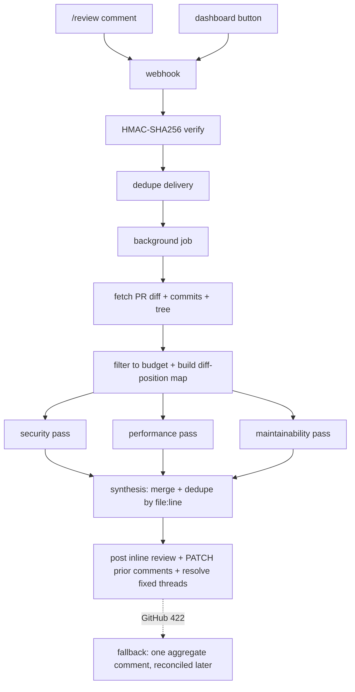

# Geckode

> A multi-agent AI code-review system for GitHub. On a pull request, Geckode runs parallel specialist reviewers — **security, performance, and maintainability** — synthesizes their findings into one deduplicated review, and posts it inline on the diff. On every follow-up review it updates its own comments in place and resolves the threads it considers fixed, instead of re-spamming the PR.

A single AI "review this PR" prompt is shallow: it skims the diff and misses what matters on different axes. Geckode treats review the way a strong team does — several specialists read the same code through different lenses, then one consolidated verdict lands where the team already works, and *stays coherent* across the life of the PR.

> **Project status.** Personal engineering project (2026), built and deployed end-to-end. It is not pursued as a commercial product — the space is well served by tools like CodeRabbit — and has no external users. It exists as a working demonstration of multi-agent orchestration wired into a real platform, end to end. See [Scope & honest limitations](#scope--honest-limitations).

---

## What it does

- **One-click connect.** Sign in with GitHub, pick a repo — Geckode registers its own webhook. No URL to paste, no YAML required.
- **Trigger on demand.** Comment `/review` on a PR (optionally with freeform instructions after it), or click *Review* in the dashboard. Same engine either way.
- **Multi-lens council.** Up to three specialist passes — security, performance, maintainability — each read the diff independently with a focused prompt.
- **Synthesis.** Findings are merged and deduplicated into a single review — not three separate noisy bots.
- **Lands inline, on the right lines.** Posts one PR review with inline comments anchored to exact diff positions, plus a summary.
- **Stays in sync.** On a follow-up review it PATCHes its prior comments and resolves threads whose issue the new diff fixes — no duplicate spam.
- **Per-repo standards.** Primary language, strictness, and which dimensions run (and how hard) are configurable via a dashboard or a committed `.reviewer.yml`.

## Architecture

```
  /review comment ─┐
                   ├─► webhook  ──►  HMAC-SHA256 verify  ──►  dedupe delivery  ──►  background job
  dashboard button ─┘                                                                   │
                                                                                        ▼
                         fetch PR diff + commits + repo tree (GitHub REST)              │
                                                                                        ▼
                         filter diff to budget (drop generated/vendored, largest-first) │
                         build diff-position map (new-file line → diff position)         │
                                                                                        ▼
                  ┌──────────────────────┬───────────────────────┐   parallel (ThreadPoolExecutor)
                  ▼                      ▼                       ▼
             security              performance            maintainability     ← specialist passes
            (Gemini, model            (Gemini)                (Gemini)            structured-JSON out
             chosen per pass)                                                     model picked per pass
                  └──────────────────────┴───────────────────────┘
                                         ▼
                          synthesis pass — merge + dedupe by file:line
                                         ▼
        post one inline review  +  PATCH prior comments  +  resolve fixed threads (GraphQL)
                                         ▼
                     on GitHub 422 → fall back to a single aggregate comment,
                     reconciled back to inline comments on a later review
```


_The three specialist passes run concurrently (one `ThreadPoolExecutor`); synthesis waits on all of them._

**Hand-rolled orchestration, no framework.** Specialist agents run concurrently via Python's `ThreadPoolExecutor`, each with its own role prompt over the same diff; a dedicated synthesis pass then resolves overlap and emits one structured-JSON review. Built from primitives so every step — prompt, model, budget, merge — is under direct control. The same "many specialists → one answer" council pattern generalizes well beyond code review.

**Cost-aware model routing.** Geckode runs on Google Gemini, but selects the model *per pass*: a fast model for light passes, a stronger model when the diff is security-sensitive or large, and a separate model for synthesis — so spend tracks the work. The routing layer is provider-agnostic; enabling additional providers is a configuration change.

## Production details that matter

The interesting engineering is in the parts that separate a demo from a product:

- **Exact inline anchoring.** GitHub's review API needs *diff positions*, not file line numbers. A custom diff parser maps `new-file line → diff position` per file; the diff is trimmed to a token budget by dropping whole files largest-first (never mid-file) so line numbers stay aligned with GitHub's view.
- **Stateful follow-up reviews.** Each posted comment's `file:line → comment id` is snapshotted, so re-reviews PATCH the existing comment instead of duplicating, and auto-resolve threads the diff now fixes (model-decided, with a heuristic backstop).
- **Graceful degradation.** If GitHub rejects the inline review (422), Geckode posts one aggregate comment instead — then parses that comment back on a later run to reconcile which findings are fixed.
- **Security & privacy posture.** Source code and diffs are **never persisted** — only repo settings and comment metadata (path/line/id). OAuth tokens and webhook secrets are **encrypted at rest (Fernet)**; webhooks are verified with **HMAC-SHA256**; duplicate webhook deliveries are de-duped with bounded, amortized cleanup.
- **Resilient GitHub access.** Posts as a bot token first, falls back to the connecting user's OAuth token on 403/404; thread resolution uses GraphQL (no REST equivalent).
- **Budget guardrails throughout** — diff size, repo-tree appendix, and synthesis input are each capped to keep latency and token cost predictable.

## Evaluation — how I'd measure "correct"

Calling an AI reviewer "good" without defining correctness is hand-waving. Here's the eval model this is built toward, and what's actually in place:

- **What correctness means here:** precision and recall of findings against PRs with known issues; a low false-positive rate (noise is what kills review bots); zero hallucinated line references; correct dedup (one comment per real issue) and correct resolution (only close threads the diff actually fixed).
- **What's verified deterministically today:** the diff-position mapping and budget filtering are pure functions with unit tests — the "comment lands on the right line" correctness floor is covered, because a wrong map is the failure mode that silently posts garbage onto the wrong code.
- **What a full eval harness would add (designed, not yet built — stated, not hidden):** a fixture set of PRs with annotated expected findings, scored each run for precision / recall / false-positive-rate per dimension; regression tracking when a prompt or model tier changes; and an LLM-as-judge pass grading comment usefulness against a rubric.

## Tech stack

| Layer | Tech |
|-------|------|
| Frontend | Next.js 14 (App Router) · TypeScript · Tailwind · shadcn/ui (Radix) · NextAuth — deployed on Vercel |
| Backend | FastAPI · SQLModel · `google-genai` · `cryptography` (Fernet) — containerized with Docker |
| Data | PostgreSQL in production (SQLite for local dev) |
| Integrations | GitHub OAuth · webhooks · REST + GraphQL · Gemini API |

## Repository layout

```
backend/      FastAPI app + review engine
  server.py            HTTP: webhooks, OAuth, repo + review endpoints
  review_service.py    orchestration: fetch → council → post → follow-up sync
  gemini.py            specialist passes, synthesis, structured-JSON parsing
  github_api.py        thin GitHub REST + GraphQL client
  diff_parser.py       unified-diff → position map; budget-aware filtering
  review_dimensions.py per-dimension intensity (off/low/normal/high)
  secrets_storage.py   Fernet encryption for tokens + webhook secrets
  webhook_security.py  HMAC-SHA256 signature verification
  models.py / db.py    SQLModel tables + engine/migrations
  tests/               unit tests
frontend/     Next.js 14 dashboard (see frontend/README.md)
```

## Running it locally

**Backend**

```bash
cd backend
python -m venv .venv && source .venv/bin/activate   # Windows: .venv\Scripts\activate
pip install -r requirements.txt
cp .env.example .env            # fill in GEMINI_API_KEY, GitHub OAuth app, secrets
uvicorn server:app --reload --port 8080
```

Key environment variables (see `backend/.env.example` for the full list):

| Var | Purpose |
|-----|---------|
| `GEMINI_API_KEY` | Gemini access (required) |
| `GITHUB_TOKEN` | bot token used to post reviews |
| `GITHUB_CLIENT_ID` / `GITHUB_CLIENT_SECRET` | GitHub OAuth app |
| `PUBLIC_BASE_URL` | public HTTPS origin (webhooks can't target localhost) |
| `ENCRYPTION_KEY` | Fernet key for secrets at rest (`python scripts/gen_fernet_key.py`) |
| `DATABASE_URL` | Postgres URI in production; SQLite by default |
| `GECKODE_ALLOWED_LOGINS` | optional allowlist of GitHub logins permitted to use the deployment |

GitHub won't register a webhook against `localhost` — expose the backend with a tunnel (ngrok / Cloudflare Tunnel) and set `PUBLIC_BASE_URL` to that origin.

**Frontend** — see [`frontend/README.md`](frontend/README.md) for setup; in short: `cd frontend && npm install && cp .env.example .env.local && npm run dev`.

**Tests**

```bash
cd backend
python -m unittest discover     # stdlib only, no extra deps
```

## Configuration

Per-repo review behavior is set from the dashboard or a `.reviewer.yml` committed to the repo:

```yaml
language: python
standards:
  - PEP 8
  - type hints on public functions
  - no bare except clauses
strictness: high     # low | medium | high
```

Each council dimension (security / performance / maintainability) can independently be set to `off`, `low`, `normal`, or `high`, which adjusts both how strictly that lens reviews and which model tier runs it.

## Scope & honest limitations

This is a focused engineering project, not a hardened SaaS. Known limitations and the things I'd harden before real production use:

- **Tests focus on pure logic** — diff position-mapping, webhook signature verification, config parsing, and the tree/trigger helpers are unit-tested; the orchestration and live GitHub integration paths are exercised manually rather than with mocked integration tests.
- **Single-instance state** — webhook dedup, the bearer-token cache, and OAuth state live in process memory; horizontal scaling would move these to Redis or the database.
- **Gemini-only today** — the model router is provider-agnostic, but only Gemini is wired up.

These are deliberate scope choices for a personal project; none are hard to address, and they're called out here rather than hidden.
